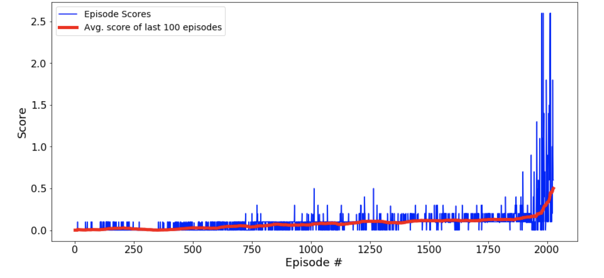

# Collaboration and Competition

## Project's goal

In this environment, two agents control rackets to bounce a ball over a net, the goal of each agent is to keep the ball in play.Problem solved by MADDPG Algorithm.

Detailed explanation is available in [report file](https://github.com/aylingizem/tennis/blob/master/report.pdf)


## Project Details
* If an agent hits the ball over the net, it receives a reward of +0.1. 
* If an agent lets a ball hit the ground or hits the ball out of bounds, it receives a reward of -0.01.
* The project environment is similar to, but not identical to the Tennis environment on the [Unity ML-Agents](https://github.com/Unity-Technologies/ml-agents/blob/master/docs/Learning-Environment-Examples.md)
* The observation space consists of 8 variables corresponding to the position and velocity of the ball and racket. Each agent receives its own, local observation. Two continuous actions are available, corresponding to movement toward (or away from) the net, and jumping.
* The environment is considered solved, when the average (over 100 episodes) of those scores is at least +0.5.

## Instructions 

1. To install the requirements
```
pip install -r requirements.txt
```
2. Download the [Tennis Environment](https://github.com/Unity-Technologies/ml-agents/blob/master/docs/Learning-Environment-Examples.md)

3. run the [Tennis.ipynb](https://github.com/aylingizem/tennis/blob/master/Tennis.ipynb)

## Conclusion



In this scenario,

* Environment solved in 2027 episodes and the average score is  0.501
